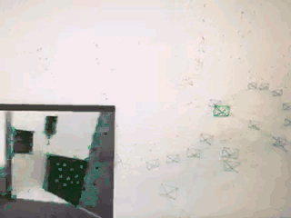
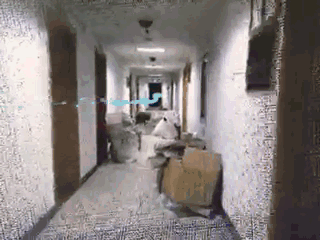
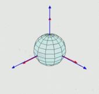

#SLAM Introduction

the sparse map of SLAM  

the dense map of SLAM  

#Cylinder Block Model

a Cylinder block model has six degree of freedom, rotation has three and translation has three. which can be described as follow.  

#Pinhole Camera Model

a pinhole camera coordinate can be described as follow  

   

 \text{in world coordinate}}\\\
P_c{\text{ is point} (X_c, Y_c, Z_c, 1) \text{in camera coordinate}})
